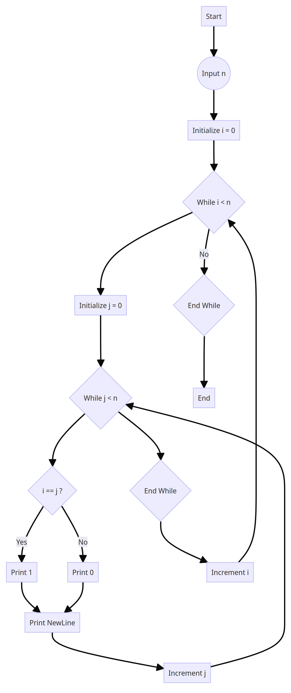
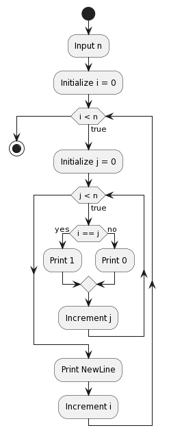

# uts_sp_alpro

<strong>Repository ini dibuat untuk memenuhi uts alpro</strong>
| <strong>Nama</strong>      | <strong>Riris Naomi Gurning</strong>  |
| ----------- | ----------- |
| <strong>NIM</strong>     | <strong>312010190</strong>       |
| <strong>Kelas</strong>   | <strong>TI.20.A.1</strong>        |

[Soal UTS Sp](Soal_Tugas_Sp.pdf)
<p>Berikut adalah implementasi algoritma matriks identitas berordo n dalam bahasa pemrograman Python dan flowchart:</p>

<b>Pseudo Code</b>
```
def print_identity_matrix(n):
    for i in range(n):
        for j in range(n):
            if i == j:
                print("1", end="")
            else:
                print("0", end="")
        print()

n = int(input("Masukkan jumlah ordo matriks (n): "))
print("Matriks Identitas:")
print_identity_matrix(n)
```

<b>Flowchart:</b>


